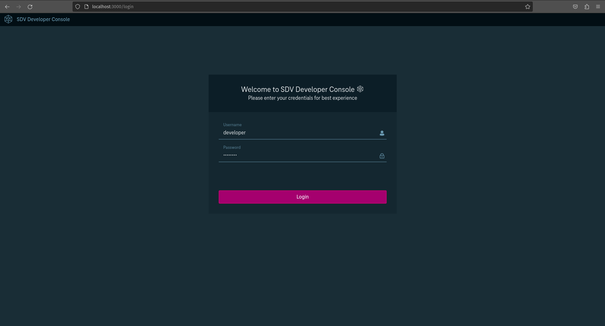
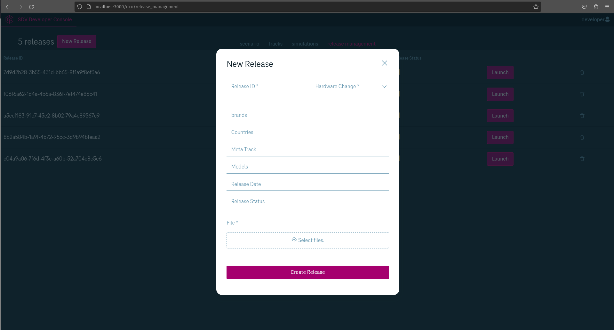
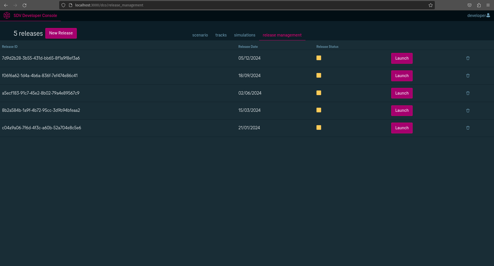

#  Eclipse-DCO Battery Simulation Hack-Challenge

# About

Are you ready to charge ahead and revolutionize the world of energy management? :earth_africa::zap:

Bring your coding skills to the forefront as you decode the secrets of EV battery dynamics **simulation** and engineer solutions for a **sustainable** future. You'll encounter a predefined scenario that presents a challenge encompassing topics such as battery and fleet management. You will do so by harnessing the combined power of two Eclipse Projects - SDV Developer Console and SUMO.
Power up your creativity and sign up for Eclipse SDV Hackathon Challenge! :rocket::battery:

Eclipse Developer Console UI

Eclipse SUMO

Architecture

# Hack Ideas

- Extend the Battery Integration Example
- Simulate other vehicle attributes supported by Eclipse Sumo
- Create multi-dimensional simulation scenarios covering different areas of the vehicle
- Integrate other simulation tools, e.g. Eclipse MOSAIC, to achieve additional simulation and visualisation options
- Develop robust automated deployment pipelines that seamlessly integrate the Release Management capabilities of DCO with the simulation capabilities of SUMO
- Build a real-time monitoring system that collects data from DCO and SUMO to provide insightful analytics and visualizations
- Integrate external APIs such as weather APIs, traffic data to enhance the SUMO simulation with dynamic real-world data
- Implement Security checks and Safety measures within the release management to detect and respond to potential security threats or safety-critical issues in real-time
- Explore machine learning techniques (AI) to create adaptive learning algorithms, use the SUMO simulation to train and improve the algorithms over time, making the release management solution smarter
- Develop a module for managing releases for a fleet of self-driving vehicles
- Create a system that allows for dynamic updates of the software stack for seamless over-the-air updates ensuring DCO can handle versioning and compability issues
- Implement a remote diagnostics feature the enables monitorng and troubleshooting in DCO to provide insights on health and performance issues
- Optimize the release management solution for scalability by ensuring efficient resource allocation to handle fleets of vehicles
- Think of machine learning algorithms to predict maintenance needs for Software Defined components in vehicles, by using historical data from DCO (historical data needs to be mocked)

# Need to know

- Git
- Maven
- Java Spring Boot
- NextJS React

# Hack-Coaches

- Sebastian Lang
- Michail Chatzipanagiotou

# Template Setup

[Getting Started](https://github.com/Eclipse-SDV-Hackathon-Accenture/dco-hack-challenge/blob/main/README_DCO.md)

# All necessary links

- Eclipse SDV Developer Console: https://gitlab.eclipse.org/eclipse/dco/developer-console
- Eclipse SUMO: https://github.com/eclipse-sumo/sumo
