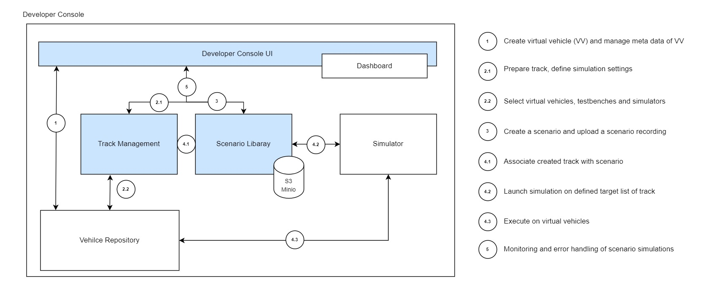

# Developer-Console
 

## Description
SDV-Developer Console(DCO) integrates all necessary sources for software lifecycle management and thereby optimizes the complete process from development to release of software. Our core of DCO includes services for development, testing, simulations, release and lifecycle management of software. Hereby, SDV-DCOs mission is to automize as much as possible by using different concepts of re-usability and standardization by connecting different business roles along the software lifecycle on one source. As our open-source contribution, we focus on simulation of services with SDV DCO - it includes

* Developer Console UI
* Track Management
* Scenario Library
* New Simulation
   
SDV- DCO enables the user with  advanced user interface to plan, prepare, execute and monitor simulations of scenarios – from vehicle & fleet behaviour to services for software defined vehicles. Everyone, can create scenarios as well as simulations of these scenarios, with integrating third-party solutions and services for instance simulators, virtual vehicle repositories or simulations analysis and monitoring tools.

#### Develop simulation space
 
###### Simulation
* Vehicle Simulations
* Simulate a vehicle for test activity
* Simulate a vehicle for non-regression
* Simulate a fleet of vehicle (e.g. with unitary behavior e.g. overload)
* Simulates basic vehicle functionalities
  
###### Simulated Services:
* Remote Control: Simulate answers to remote orders
* Data collect: Simulate data collection about the car status
* OTA: Simulates the interactions with the OTA server
* Device Management: Handles the basic connectivity with backend
* xCall:  e.g. simulate emergency call
  
###### Future Scope:
* Test Result Analysis
* Defect Tracking
* Reporting



> <span style="color:blue"> **Note:** </span>
<span style="color:blue"> **The Eclipse-SDV DCO consists of four micro-services such as DCO-UI, Track-Management-Service, Scenario-Management-Service, and Gateway-Service. These micro-services have been consolidated into the DCO-Mono-repo, named "developer-console" to simplify the deployment process for open source developers, eliminating the need for multiple deployment steps.**</span>

## Badges

      

    

    


## Installation and Pre-requisites

There are some pre-requisites. You should install java 17, spring-graphql, maven, nextjs, graphql, docker and docker compose on your local machine before getting started.

##### Technology Stack

[](https://skills.thijs.gg)

| Technology/Tools  |        Version        |
| :-------------    | :---------            |
| Java              | 17                    |
| Spring-Boot       | 3.1.0                 |
| spring-graphql    | 1.2 or Above          |
| Maven             | 3.8 or Above          |
| nextjs            | 12.1.0 or Above       |
| GraphQL           | 16.4.0 or Above       |
| Docker            | 20.10.17 or Above     |
| Docker Compose    | v2.10.2 or Above      |
 
## Getting started 
###### Check versions of all installed applications
Please ensure that all above softwares and listed versions are installed/available on your machine and can verify using below commands.

```bash
git version
java --version
node --version
mvn --version
docker --version
docker compose version
```
If you have all required tools and softwares installed on your machine then you are ready to start application installation. :sunglasses:
###### Clone SDV DCO repository
Clone the repository using below command. Use gitlab token if required.
```bash
# git clone
git clone https://gitlab.eclipse.org/eclipse/dco/developer-console.git

#change working directory
cd developer-console
```

### Build and Deploy

> <span style="color:blue"> **Note:** </span>
<span style="color:blue"> **If you do not have docker and docker compose on your machine or you are using Windows machine then below automation scripts/steps will not work as it is. In that case you have to build and install dco micro-services manually, and you have to refer below steps and screenshots to understand the configuration. Remember, Minio is a pre-requisite for scenario-library-service. Also, you will get postgres sql scripts under postgres directory.**</span>

###### Step 1: Build all micro-services and install **Minio** on local.
In this step, we are going to build all four micro-services and install Minio server as it is pre-requisite for scenario-library-service.

**Note:** If you have already followed below steps, please make sure you are using latest images and executables. On sefer side, you can simply execute clean up commands before you start with build and deploy steps.

```bash
# Change execution permission of build shell script
chmod +x 10-build-script.sh

# Build apps and install Minio.
sh 10-build-script.sh
```

###### Step 2: Create a new bucket named, **dco-scenario-library-service** and generate **access-key** and **secret-key** in Minio
  >  A) Access Minio using http://localhost:9001 url. The admin user is "**minioadmin**" and default password is "**minioadmin**"

    <br></br>
  >  B) Create a bucket with name "dco-scenario-library-service"

    <br></br>
  >  C) Generate access key and secret key.
       Save both key values for future use as we need to pass both values as arguments while running deployment script.


After creating and configuring the **dco-scenario-library-service** bucket, **access key** and **secret key** in Minio, run deploy script to run all dockerized micro-services on local machine using docker compose.

---

###### Step 3: Deploy - Run all micro-services including postgres database and pgadmin client for database.
```bash
# Change execution permission of deploy shell script
chmod +x 20-deploy-script.sh

# Execute deploy script by passing newly generated minio access key and secret key
sh 20-deploy-script.sh <access-key> <secrete-key>
```
After successful execution of deploy step 3, you can use below urls to access web-application, playground and swagger for REST APIs.

> 1) **Developer Console UI**: http://localhost:3000
The username is "**developer**" and password is "**password**"
  
    <br></br>
> 2) **dco-gateway** playground for REST APIs: http://localhost:8080/playground
The username is "**developer**" and password is "**password**"
 
    <br></br>
> 3) **tracks-management-service** swagger for REST APIs: http://localhost:8081/openapi/swagger-ui/index.html
The username is "**developer**" and password is "**password**"

    <br></br>
> 4) **scenario-library-service** swagger for REST APIs: http://localhost:8082/openapi/swagger-ui/index.html
The username is "**developer**" and password is "**password**"  

    <br></br>
> 5) **pgadmin** client url: http://localhost:5050
The username is "**admin@default.com**" and password is "**admin**"

<br></br>
    a) Then click on **Add New Server** option and add server name as **local**.
    
    <br></br>
    b) Click on **connection** tab and provide below details.
     Host name/ Address  : _postgres_   
     port                : _5432_       
     Maintenance Database: _postgres_   
     Username            : _postgres_   
     Password            : _postgres_    
    
    <br></br>
    c) Click on ***Save*** button. You will see below screen after successful connection.
    
---

### How to use SDV DCO?
The steps involved in utilizing the SDV-Developer Console (DCO), specifically the SDV-DCO, Simulation platform :
 
1. Access the Developer Console UI:
   - Log in to the DCO platform using the provided credentials.
   - The Developer Console UI serves as the central hub for managing the Simulation platform.
 
2. Create Scenarios:
   - In the Scenario section of DCO, click the "New Scenario" button to create and manage various scenarios.
   - These scenarios simulate different aspects of software behavior, such as vehicle and fleet behavior or services for software-defined vehicles.
   - These scenarios serve as a foundation for simulations and testing.
 
3.  Create Track (Using Vehicle ID/Information )  
   - Navigate Track Management
   - Within the Developer Console UI, locate the Track section.
   - This feature allows you to define and organize different tracks or projects associated with different vehicles that are part of the new scenarios.
 
4. Plan New Simulations:
    - While creating simulation we have to define a scenario with a track.
   - Once you have created scenarios, use DCO's advanced user interface to plan “New simulations” by using New simulation button .
   - Define simulation parameters, specify the scenarios to be simulated, and configure other relevant settings.
   - Launch the simulations.
  
5. Iterate and Refine:
   - Based on the insights gained from the simulation results, iterate and refine your software development and lifecycle processes.
   - Adjust scenarios, simulation parameters, and integrated services as necessary to enhance the overall software quality and performance.

6. Monitor/View Simulation:
   - During the execution of simulations, monitor the progress and gather relevant data using the Simulation view provided by DCO.
   - This enables you to assess the behavior and performance of the software throughout the simulated scenarios.
 
7. Prepare and Execute Simulations: - (To be Planned)
   - Before executing simulations, DCO prepares the necessary resources and configurations.
   - It leverages reusability and standardization concepts to optimize the process and reduce manual effort.
   - DCO allows integration of third-party solutions and services, such as simulators, virtual vehicle repositories, or simulation analysis and monitoring tools.
 
8. Analyze and Evaluate Results: - (To be Planned)
   - Once the simulations are complete, analyze the gathered data and evaluate the results.
   - This analysis helps in understanding the impact of different scenarios on the software and identifying areas for improvement or optimization.
 

 
By following these steps, you can leverage the SDV-Developer Console (DCO) platform, specifically the Simulation activities for multiple scenarios involving vehicles.

---
### Clean Up:
Once you are done with the exploring of SDV DCO, you can use below steps to simply delete all configured and installed services and tools from your machine.
###### Remove all micro-services, Minio, postgres database and pgadmin client from local machine.
```bash
# Change execution permission of destroy shell script
chmod +x 30-destroy-script.sh

# To remove all apps.
sh 30-destroy-script.sh
```

## Contributing
For people who want to make changes to this project, please refer [CONTRIBUTING.md](CONTRIBUTING.md) file for details.

## License
For license details, please refer [LICENSE.md](LICENSE.md) file

## Architecture
SDV DCO Architecture


&copy; T-Systems
