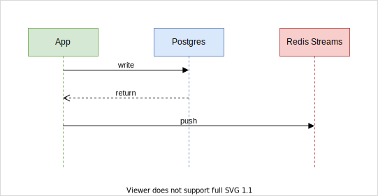

[[architecture]]
== Architecture

Proin venenatis fermentum velit, in dictum mi maximus ac. Nam augue lectus, finibus in semper aliquet, ornare sit amet libero. Nullam eget est sit amet felis pulvinar tincidunt. Aliquam laoreet est nec nisl euismod, quis laoreet orci ultricies. Etiam tincidunt nibh in nunc volutpat eleifend sed vitae ex. Maecenas vitae urna interdum sapien euismod commodo vitae at neque. Ut sit amet scelerisque ex. Praesent at nisi semper, ullamcorper elit eu, placerat lorem. Donec sit amet aliquam tortor. Cras imperdiet convallis ligula et maximus. In posuere purus vel nisl sodales aliquet.

=== Component Model

Proin venenatis fermentum velit, in dictum mi maximus ac. Nam augue lectus, finibus in semper aliquet, ornare sit amet libero. Nullam eget est sit amet felis pulvinar tincidunt. Aliquam laoreet est nec nisl euismod, quis laoreet orci ultricies. Etiam tincidunt nibh in nunc volutpat eleifend sed vitae ex.

=== Data Model

Proin venenatis fermentum velit, in dictum mi maximus ac. Nam augue lectus, finibus in semper aliquet, ornare sit amet libero. Nullam eget est sit amet felis pulvinar tincidunt. Aliquam laoreet est nec nisl euismod, quis laoreet orci ultricies. Etiam tincidunt nibh in nunc volutpat eleifend sed vitae ex.

image::./images/data-model.svg[]

=== Runtime Behaviour

Proin venenatis fermentum velit, in dictum mi maximus ac. Nam augue lectus, finibus in semper aliquet, ornare sit amet libero. Nullam eget est sit amet felis pulvinar tincidunt. Aliquam laoreet est nec nisl euismod, quis laoreet orci ultricies. Etiam tincidunt nibh in nunc volutpat eleifend sed vitae ex.

